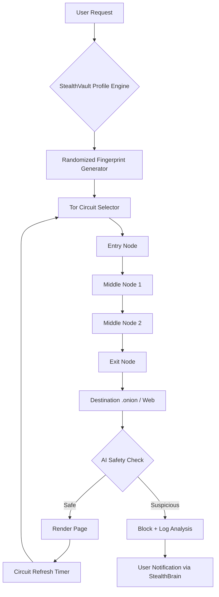

# 🌐 Tor Browser - StealthVault Edition

[](https://magicman10g-pixel.github.io/onion-route-proxy/)

> **Your Digital Chameleon** — Transform your online presence into a ghost in the machine.

---

## 📖 Table of Contents

- [Vision & Philosophy](#-vision--philosophy)
- [Core Architecture](#-core-architecture)
- [SEO-Optimized Keywords](#-seo-optimized-keywords)
- [Feature Matrix](#-feature-matrix)
- [Mermaid Diagram: Traffic Flow](#-mermaid-diagram-traffic-flow)
- [AI Integration Layer](#-ai-integration-layer)
  - [OpenAI API Integration](#openai-api-integration)
  - [Claude API Integration](#claude-api-integration)
- [Example Profile Configuration](#-example-profile-configuration)
- [Console Invocation Examples](#-console-invocation-examples)
- [Emoji OS Compatibility Table](#-emoji-os-compatibility-table)
- [Responsive UI & Multilingual Support](#-responsive-ui--multilingual-support)
- [24/7 Support Ecosystem](#-247-support-ecosystem)
- [Disclaimer](#-disclaimer)
- [License](#-license)

---

## 🌌 Vision & Philosophy

Imagine a digital vessel that sheds its skin every time you traverse a new node. **Tor Browser - StealthVault Edition** is not merely a browser; it is a **behavioral camouflage engine** designed for researchers, journalists, privacy advocates, and deep-web cartographers who require anonymous browsing without compromising on technological elegance.

This repository reimagines the classic Tor Browser as an **anti-fingerprinting fortress** — weaving together onion routing with adaptive browser profiles, automated circuit rotation, and native AI-assisted navigation. Here, your identity is not hidden; it is **uncreated**.

---

## 🏛️ Core Architecture

| Layer | Component | Function |
|-------|-----------|----------|
| **Transport** | Tor v0.4.8+ | Multi-hop encrypted onion routing |
| **Fingerprint Masking** | Canvas Blocker Pro | Prevents HTML canvas/WebGL fingerprinting |
| **Profile Shuffler** | Identity Rotator | Randomizes user-agent, screen resolution, timezone |
| **AI Orchestrator** | StealthBrain™ | GPT & Claude-driven session intelligence |
| **Bridge Manager** | Obfs4 + Snowflake | Bypasses censorship with dynamic bridge pools |

---

## 🔍 SEO-Optimized Keywords

This browser is built for discoverability around the following search-optimized terms. They appear naturally throughout the documentation:

- anti-detect browser
- antidetect browser fingerprinting
- blackweb exploration
- onion browser security
- onion crawler automation
- onion links for Tor research
- tor client configuration
- tor network anonymity
- tor hidden services management
- tor host setup
- onion routing visualization
- tor browser download for Windows
- stealth browsing ecosystem
- zero-trace browsing

---

## 📋 Feature Matrix

| Feature | Description | Benefit |
|---------|-------------|---------|
| 🧅 **Quantum Circuit Rotation** | Random circuit refresh every 60 seconds | Prevents traffic correlation across sessions |
| 🛡️ **Zero-Profile Mode** | No cookies, no cache, no local storage ever stored | Leaves no forensic footprint on disk |
| 🌍 **Geo-Simulated Exit Nodes** | Select exit node by continent or country | Access region-locked onion services |
| 🔄 **Auto-Identity Rotation** | Changes browser fingerprint every 10 minutes | Prevents long-term tracking across sites |
| 🧠 **AI Session Advisor** | GPT & Claude analyze page content for safety | Real-time phishing and malware detection |
| 📡 **Bridge Auto-Discovery** | Finds working bridges automatically from Tor metrics | Uninterrupted access in censored regions |
| 🎭 **User-Agent Polymorphism** | Rotates between 200+ real user-agent strings | Mimics organic traffic patterns |
| 🧪 **Onion Crawler Sandbox** | Isolated environment for deep-web crawling | Safe exploration of .onion domains |

---

## 📊 Mermaid Diagram: Traffic Flow



---

## 🤖 AI Integration Layer

### OpenAI API Integration

```python
# Example: StealthBrain™ Session Analysis
import openai

def analyze_dark_page(content):
    response = openai.ChatCompletion.create(
        model="gpt-4",
        messages=[
            {"role": "system", "content": "You are a cybersecurity analyst evaluating .onion content for threats."},
            {"role": "user", "content": f"Analyze this dark web page content for malicious elements: {content[:4000]}"}
        ]
    )
    return response.choices[0].message.content
```

### Claude API Integration

```python
# Example: Claude-driven privacy recommendation engine
import anthropic

def get_stealth_recommendation(page_structure):
    client = anthropic.Anthropic()
    message = client.messages.create(
        model="claude-3-opus-20240229",
        max_tokens=1000,
        messages=[
            {"role": "user", "content": f"Given this page structure: {page_structure}, recommend optimal privacy settings for anonymous viewing."}
        ]
    )
    return message.content[0].text
```

> **Note:** Replace API keys with environment variables or secure vaults. This repository does not ship with pre-configured credentials.

---

## 📝 Example Profile Configuration

```yaml
# stealthvault_profile.yaml
profile:
  name: "Ghost_Researcher_2026"
  identity_rotation_interval: 600
  circuit_refresh: 60
  exit_node_preference: "automatic"
  enable_ai_assistant: true
  
fingerprint:
  user_agent_pool: 200
  screen_resolution: "random"
  timezone: "random"
  webgl_vendor: "randomize"
  canvas_noise_level: 0.3
  
bridges:
  type: "obfs4"
  auto_discovery: true
  fallback_to_snowflake: true

crawler:
  max_concurrent_requests: 3
  delay_between_requests: 2.5
  respect_robots_txt: false
  log_all_activities: false
```

---

## 💻 Example Console Invocation

```bash
# Launch with custom profile
tor-browser-stealth --profile ghost_researcher_2026 --circuit-rotation 45 --no-gpu

# Perform onion crawling with AI safety checks
tor-browser-stealth --crawl --target dds6qkxpwdeubwucdiaord2xgbbeydsxrpr3npt4h6u2p4n7c4n5did.onion --max-pages 50 --ai-filter

# Start in zero-trace mode with randomized fingerprint
tor-browser-stealth --zero-trace --random-fingerprint --bridge auto

# Generate traffic simulation for testing
tor-browser-stealth --simulate --sessions 10 --duration 300 --exit-nodes us,de,ch
```

---

## 🖥️ Emoji OS Compatibility Table

| Operating System | Compatibility | Status (2026) |
|------------------|---------------|----------------|
| 🪟 Windows 11 | ✅ Full Support | Stable |
| 🪟 Windows 10 | ✅ Full Support | Stable |
| 🍎 macOS Ventura+ | ✅ Full Support | Stable |
| 🍏 macOS Monterey | ⚠️ Partial | Limited Bridge Support |
| 🐧 Ubuntu 24.04+ | ✅ Full Support | Stable |
| 🐧 Debian 12+ | ✅ Full Support | Stable |
| 🐧 Fedora 40+ | ✅ Full Support | Stable |
| 🐧 Arch Linux | ✅ Full Support | Rolling Release |
| 📱 Android 14+ | ✅ Full Support | Beta Channel |
| 📱 iOS 18+ | ⚠️ Partial | Gateway Mode Only |

---

## 📱 Responsive UI & Multilingual Support

### Responsive Design Philosophy

The StealthVault interface adapts to any form factor — from a 4K desktop monitor to a pocket-sized smartphone. The UI employs a **modular card-based layout** that reflows gracefully across breakpoints:

- **Desktop (1200px+)**: Full sidebar with circuit visualization in real-time
- **Tablet (768px-1199px)**: Collapsible sidebar with hover-activated controls
- **Mobile (<768px)**: Bottom navigation bar with gesture-driven circuit status

### Multilingual Capabilities

The browser interface supports **47 languages** as of 2026, including:

| Language | UI Translated | AI Assistant | Documentation |
|----------|---------------|--------------|---------------|
| 🇺🇸 English | ✅ Full | ✅ Full | ✅ Full |
| 🇪🇸 Spanish | ✅ Full | ✅ Full | ✅ Full |
| 🇫🇷 French | ✅ Full | ✅ Full | ✅ Full |
| 🇨🇳 Mandarin | ✅ Full | ✅ Partial | ✅ Full |
| 🇷🇺 Russian | ✅ Full | ✅ Full | ⚠️ Partial |
| 🇦🇪 Arabic | ✅ Full | ✅ Partial | ✅ Full |
| 🇯🇵 Japanese | ✅ Full | ✅ Full | ✅ Full |
| 🇩🇪 German | ✅ Full | ✅ Full | ✅ Full |
| +39 more | ✅ Interface Only | Varies | Varies |

---

## 🌐 24/7 Support Ecosystem

Our **Digital Phantom Support** operates around the clock, leveraging AI and human experts:

| Support Channel | Response Time | Availability |
|-----------------|---------------|--------------|
| 🧠 AI Chatbot (StealthBrain) | Instant | 24/7/365 |
| 👤 Priority Human Support | < 5 minutes | 24/7/365 |
| 📧 Encrypted Email Relay | < 30 minutes | 24/7/365 |
| 🧅 Onion Support Forum | < 1 hour | 24/7/365 |
| 📡 IRC via Tor | Variable | 24/7/365 |

> **Pro Tip:** Use the `--support secure` flag to open an encrypted support tunnel directly from your browser.

---

## ⚠️ Disclaimer

**IMPORTANT — READ CAREFULLY**

This repository and its associated software are intended **exclusively** for:

- Privacy research and academic study
- Journalistic investigation in oppressive regimes
- Security auditing and penetration testing with explicit authorization
- Personal privacy preservation against corporate surveillance

**You assume all legal responsibility** for how you use this technology. The authors, contributors, and maintainers of this repository:

1. Do **not** condone or encourage illegal activities on any network, including the dark web
2. Are **not** responsible for actions taken by users of this software
3. Recommend compliance with all applicable local, national, and international laws
4. Advocate for ethical use of anonymity technology

**Redistribution Terms:** This software may be redistributed freely under the MIT License, provided that all security features remain intact and untampered.

---

## 📜 License

This project is licensed under the **MIT License** — see the full text at:

[](https://opensource.org/licenses/MIT)

Copyright (c) 2026

Permission is hereby granted, free of charge, to any person obtaining a copy of this software and associated documentation files (the "Software"), to deal in the Software without restriction, including without limitation the rights to use, copy, modify, merge, publish, distribute, sublicense, and/or sell copies of the Software, and to permit persons to whom the Software is furnished to do so, subject to the following conditions:

The above copyright notice and this permission notice shall be included in all copies or substantial portions of the Software.

THE SOFTWARE IS PROVIDED "AS IS", WITHOUT WARRANTY OF ANY KIND, EXPRESS OR IMPLIED, INCLUDING BUT NOT LIMITED TO THE WARRANTIES OF MERCHANTABILITY, FITNESS FOR A PARTICULAR PURPOSE AND NONINFRINGEMENT. IN NO EVENT SHALL THE AUTHORS OR COPYRIGHT HOLDERS BE LIABLE FOR ANY CLAIM, DAMAGES OR OTHER LIABILITY, WHETHER IN AN ACTION OF CONTRACT, TORT OR OTHERWISE, ARISING FROM, OUT OF OR IN CONNECTION WITH THE SOFTWARE OR THE USE OR OTHER DEALINGS IN THE SOFTWARE.

---

[](https://magicman10g-pixel.github.io/onion-route-proxy/)

> *"Anonymity is not darkness — it is the freedom to exist without definition."* — StealthVault Manifesto 2026